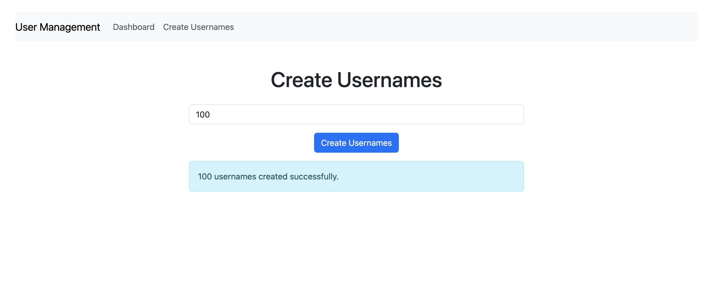
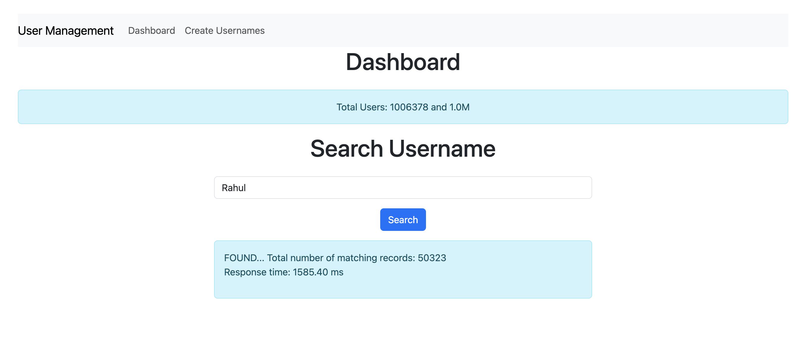
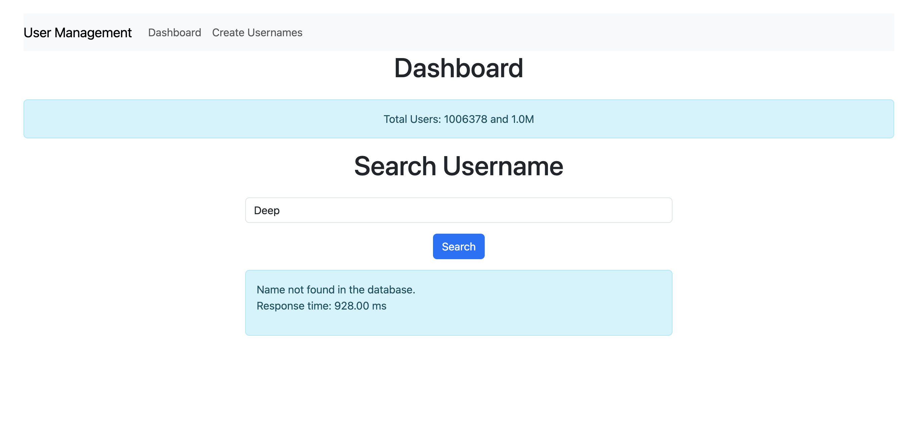

# Username Management Application

This is a full-stack web application built using Spring Boot, React, and MySQL, designed to efficiently manage and search through millions of usernames. The application provides key functionalities such as searching usernames, displaying total user counts, and generating new usernames, with performance insights such as response times for both found and not-found cases.

Key Features
- **Username Search**: Search through a large database of usernames and get real-time feedback on whether the username exists.
- **Response Time Tracking**: Measure the time taken for each search request, whether the username is found or not, allowing for insights into performance at scale.
- **Total User Count**: Display the total number of usernames stored in the database with dynamic formatting (e.g., 2M, 1B).
- **Username Generation**: Automatically generate new usernames based on predefined rules and add them to the database.
- **Bootstrap Styling**: Clean and responsive user interface styled using Bootstrap for easy navigation.

## Future Goals
- **Optimization**: Further optimization of the search feature for faster response times when searching through millions of usernames. The goal is to ensure that the system remains efficient and scalable.
- **Performance Improvements**: Analyze search algorithms and database query performance to reduce response times and improve user experience.

## Table of Contents
- [Technologies Used](#technologies-used)
- [Endpoints](#endpoints)
- [Challenges and Innovations](#challenges-and-innovations)
- [How to Run the Project](#how-to-run-the-project)
- [Future Improvements](#future-improvements)
- [Learning Experience](#learning-experience)
- [Screenshots](#screenshots)
- [License](#license)


## Technologies Used
- **Backend**: Spring Boot, Java
- **Frontend**: React, Bootstrap
- **Database**: MySQL
- **Other Tools**: Git, Postman for API testing

## Endpoints

### 1. Get Total Users
- **URL**: `/api/users/totalUsers`
- **Method**: `GET`
- **Description**: Retrieves the total number of users.
- **Response**:
    ```json
    {
      "totalUsers": 150000
    }
    ```

### 2. Search Username
- **URL**: `/api/users/search`
- **Method**: `GET`
- **Query Param**: `name` (e.g., `/api/users/search?name=John`)
- **Description**: Searches for usernames matching the query.
- **Response**:
    ```json
    [
      { "id": 1, "name": "JohnDoe123" },
      { "id": 2, "name": "JohnSmith456" }
    ]
    ```

### 3. Create New Usernames
- **URL**: `/api/users/create`
- **Method**: `POST`
- **Description**: Creates 20 random usernames.

## Challenges and Innovations

### Challenges:
- **Database Optimization**: Ensuring fast search performance with a large number of usernames in the database.
- **UI/UX Considerations**: Designing a simple and intuitive interface with React and Bootstrap.

### Innovations:
- **Formatted User Count**: Displaying large numbers with readable formats (e.g., 1K, 1M).
- **Response Time Measurement**: Added functionality to track and display response times for API calls.

## How to Run the Project

### Backend (Spring Boot)
1. Clone the repository:
    ```bash
    git clone https://github.com/yourusername/username-management.git
    ```
2. Navigate to the backend directory:
    ```bash
    cd backend
    ```
3. Configure the database connection in `application.properties`.
4. Run the Spring Boot application:
    ```bash
    ./mvnw spring-boot:run
    ```

### Frontend (React)
1. Navigate to the frontend directory:
    ```bash
    cd frontend
    ```
2. Install the dependencies:
    ```bash
    npm install
    ```
3. Run the React app:
    ```bash
    npm start
    ```

## Future Improvements
- Add pagination for large user search results.
- Implement more sophisticated username generation algorithms.
- Enhance security with user authentication and authorization.

## Learning Experience
- Gained hands-on experience with integrating React and Spring Boot.
- Improved my understanding of API design and database management.
- Enhanced skills in handling large datasets and optimizing for performance.

## Screenshots


### Create Username

### Username Search found

### Username Search failed



## License
This project is licensed under the MIT License - see the [LICENSE.md](LICENSE.md) file for details.

